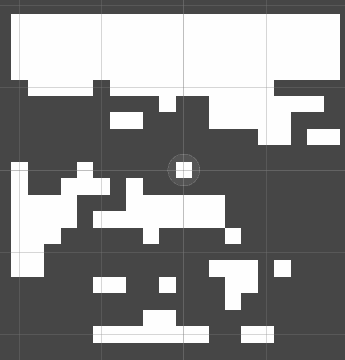
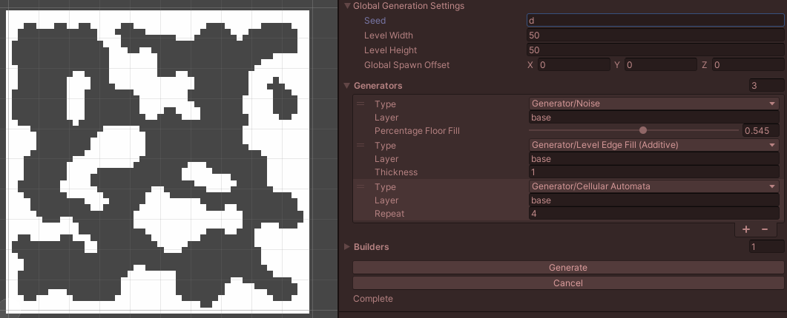
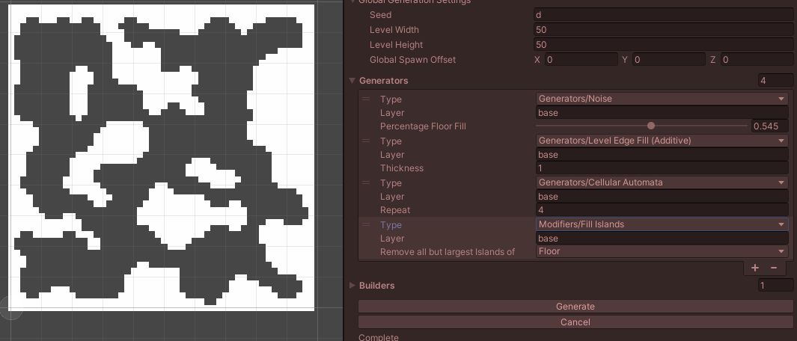
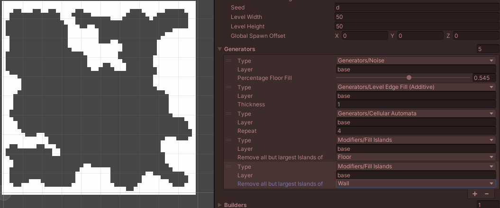

# 2DRougelikeLevelGenerator
Simple procedural level generation in Unity

## How it Works
The Generator first loops creates solid squares of "Wall", one for each layer in the list of generators.
then loops through a list of generators.

There is no difference between a "Generator" and a "Modifier". They all just do a process on a generation a layer.
Some, like DrunkWalk, are ignorant of what came before them, and will probably bug out if given a non-empty layer.
Others, like Smooth, will be useless if used first.

The layers are independent of each other, and stored as strings, but really they are keys to dictionarys behind the scenes.

After it has finished generation (in order), it will looop through the builders. The builders take a layer and spawn prefabs.

## Project Goals
Then, it will be time to create generators:
- Cellular Automata, Perlin Threshold, Scatter On Tiles, Remove Random Tiles to Threshold, Find edges
- Creating Merge/Intersect/Union/Copy Generators that can combine/separate layers.

With the union/intersect layers, it will then be possible to create things like item spawners, where one can choose random locations that are available in previous layers.
This is how I imagine the generator being used (ie: plan to use it).

## Next Steps
See project goals. Before/After that:
- Cleanup after refactoring
- Write some custom editor scripts for the config part
- Settings and the generators all in a ScriptableObject for easy saving/loading using presets.
- Use a factory pattern for generators

# Example Usages

## Cellular Automata + Island Culling
Start with Noise, then a Level Edges, then cellular automata.

Then, use the "Fill Islands" to fill all but the largest continous section of each type.

You may want to remove islands for both floors and walls.

